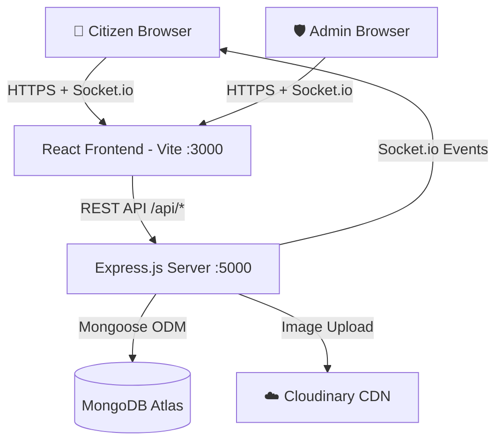

# 🏙️ CivicFix — Complete MERN Stack Documentation

> **Production-ready Civic Complaint Management System**
> Stack: MongoDB · Express.js · React.js (Vite) · Node.js · Socket.io

---

## 1. 💡 Solution Overview

CivicFix bridges the gap between citizens and government authorities by providing a **centralized, transparent, and real-time** platform for reporting and resolving civic issues.

| Problem | CivicFix Solution |
|---|---|
| No unified reporting portal | Single platform for all civic complaints |
| No transparency on status | Real-time status updates via Socket.io |
| No accountability | Admin dashboard with assignment & proof upload |
| Duplicate complaints waste resources | AI-based duplicate detection + upvoting |
| Slow manual prioritization | Auto-priority engine (category + keyword rules) |
| Citizens frustrated by silence | Instant push notifications on every status change |

---

## 2. 🏗️ System Architecture



### Data Flow: Complaint Submission → Resolution

```
Citizen fills form → React validates → POST /api/complaints (multipart)
  → Multer middleware (memory buffer)
  → Cloudinary upload (streamifier)
  → Auto-priority engine assigns priority
  → Duplicate detection checks DB
  → Complaint saved to MongoDB
  → Notification created for citizen
  → Socket.io emits to admin-room
  → Admin sees new complaint in real time
  → Admin assigns dept + updates status
  → Notification pushed to citizen via Socket.io
  → Citizen sees toast + notification bell update
```

---

## 3. 📁 Complete File Structure

```
WTCBP/
├── backend/
│   ├── server.js                    ← Express + Socket.io entry
│   ├── .env                         ← Environment variables
│   ├── config/
│   │   ├── db.js                    ← MongoDB connection
│   │   └── cloudinary.js            ← Cloudinary config
│   ├── models/
│   │   ├── User.js                  ← User schema (bcrypt)
│   │   ├── Complaint.js             ← Complaint schema
│   │   └── Notification.js          ← Notification schema
│   ├── middleware/
│   │   ├── authMiddleware.js        ← JWT protect + adminOnly
│   │   ├── uploadMiddleware.js      ← Multer memory storage
│   │   └── validateMiddleware.js    ← express-validator formatter
│   ├── controllers/
│   │   ├── authController.js        ← Register, Login, Profile
│   │   ├── complaintController.js   ← Submit, List, Detail, Upvote
│   │   ├── adminController.js       ← Full admin CRUD + Analytics
│   │   └── notificationController.js← Get, MarkRead, Delete
│   ├── routes/
│   │   ├── authRoutes.js
│   │   ├── complaintRoutes.js
│   │   ├── adminRoutes.js
│   │   └── notificationRoutes.js
│   ├── socket/
│   │   └── socketManager.js        ← Socket.io init + room management
│   └── utils/
│       ├── generateToken.js         ← JWT generator
│       ├── cloudinaryHelper.js      ← Upload/delete helpers
│       ├── notificationHelper.js    ← createNotification utility
│       └── priorityEngine.js        ← Auto-priority + duplicate detect
│
├── frontend/
│   ├── index.html                   ← SEO + Leaflet CSS
│   ├── vite.config.js               ← Vite + proxy config
│   ├── .env                         ← VITE_SOCKET_URL
│   └── src/
│       ├── main.jsx                 ← React root + providers
│       ├── App.jsx                  ← Router + route guards
│       ├── index.css                ← Complete design system
│       ├── api/
│       │   ├── axiosInstance.js     ← Axios + JWT interceptor
│       │   ├── authAPI.js
│       │   ├── complaintAPI.js
│       │   ├── adminAPI.js
│       │   └── notificationAPI.js
│       ├── context/
│       │   ├── AuthContext.jsx      ← Auth state + localStorage
│       │   └── SocketContext.jsx    ← Socket.io + real-time notifs
│       ├── components/
│       │   ├── Navbar.jsx + .css
│       │   ├── ComplaintCard.jsx + .css
│       │   ├── LocationMap.jsx      ← Leaflet interactive/view map
│       │   ├── Loader.jsx
│       │   ├── Pagination.jsx
│       │   ├── ProtectedRoute.jsx
│       │   └── AdminRoute.jsx
│       └── pages/
│           ├── LandingPage.jsx + .css
│           ├── LoginPage.jsx / RegisterPage.jsx / AuthPages.css
│           ├── CitizenDashboard.jsx + .css
│           ├── SubmitComplaint.jsx + .css
│           ├── ComplaintDetail.jsx + .css
│           ├── AdminDashboard.jsx + .css
│           ├── AdminComplaints.jsx
│           ├── AdminAnalytics.jsx + .css
│           ├── AdminUsers.jsx
│           ├── NotificationsPage.jsx + .css
│           ├── ProfilePage.jsx
│           └── NotFoundPage.jsx
│
└── seed.js                          ← Demo data seeder
```

---

## 4. 📡 API Endpoints

### Auth — `/api/auth`

| Method | Endpoint | Access | Description |
|--------|----------|--------|-------------|
| POST | `/register` | Public | Create citizen account |
| POST | `/login` | Public | Login → JWT token |
| GET | `/me` | Private | Get own profile |
| PUT | `/me` | Private | Update name/phone |

**POST /api/auth/login — Request:**
```json
{ "email": "citizen@demo.com", "password": "demo123" }
```
**Response:**
```json
{
  "success": true,
  "data": { "_id": "...", "name": "Amit", "role": "citizen", "token": "eyJ..." }
}
```

### Complaints — `/api/complaints` (Citizen)

| Method | Endpoint | Access | Description |
|--------|----------|--------|-------------|
| POST | `/` | Private | Submit complaint (multipart/form-data) |
| GET | `/my` | Private | My complaints with filters + pagination |
| GET | `/:id` | Private | Single complaint detail |
| POST | `/:id/upvote` | Private | Toggle upvote |

**POST /api/complaints — Form fields:**
```
title, description, category, address, city, pincode, lat, lng, images[]
```

### Admin — `/api/admin` (Admin Only)

| Method | Endpoint | Description |
|--------|----------|-------------|
| GET | `/complaints` | All complaints (search/filter/page/sort) |
| PUT | `/complaints/:id/status` | Update status + note |
| PUT | `/complaints/:id/assign` | Assign to department |
| POST | `/complaints/:id/proof` | Upload resolution proof images |
| GET | `/analytics` | Aggregated analytics data |
| GET | `/users` | All citizens |
| PUT | `/users/:id/toggle` | Activate / Deactivate user |

**Query params:** `?status=Pending&category=Pothole&priority=High&search=road&page=1&sort=-createdAt`

### Notifications — `/api/notifications`

| Method | Endpoint | Description |
|--------|----------|-------------|
| GET | `/` | Get all (returns unreadCount) |
| PUT | `/read` | Mark read — body: `{ ids: [] }` (empty = all) |
| DELETE | `/:id` | Delete single notification |

---

## 5. 🗄️ Database Schema Design

### Users Collection
```js
{
  name: String,           // 2-50 chars
  email: String,          // unique, lowercase
  password: String,       // bcrypt hashed, select:false
  phone: String,          // 10-digit optional
  role: 'citizen'|'admin',
  isActive: Boolean,      // default: true
  timestamps: true
}
```

### Complaints Collection
```js
{
  title: String,            // 5-100 chars
  description: String,      // 10-1000 chars
  category: Enum[10],       // Pothole, Garbage Overflow, etc.
  status: 'Pending'|'In Progress'|'Resolved'|'Rejected',
  priority: 'Low'|'Medium'|'High'|'Critical',  // auto-assigned
  images: [{ url, publicId }],
  resolutionProof: [{ url, publicId, uploadedAt }],
  location: {
    address: String,
    coordinates: { lat, lng },   // 2dsphere indexed
    city, pincode
  },
  citizen: ObjectId → User,
  assignedTo: { department, assignedAt },
  resolutionNote: String,
  resolvedAt: Date,
  upvotes: [ObjectId → User],
  isDuplicate: Boolean,
  duplicateOf: ObjectId → Complaint,
  statusHistory: [{ status, changedBy, note, changedAt }],
  timestamps: true
}
```

### Notifications Collection
```js
{
  recipient: ObjectId → User,
  type: 'COMPLAINT_SUBMITTED'|'STATUS_UPDATED'|'COMPLAINT_ASSIGNED'
       |'COMPLAINT_RESOLVED'|'COMPLAINT_REJECTED'|'ADMIN_NOTE'|'UPVOTE',
  title: String,
  message: String,
  complaint: ObjectId → Complaint,
  isRead: Boolean,
  timestamps: true
}
```

---

## 6. 🔌 Real-Time Socket.io Events

| Event | Direction | Payload |
|-------|-----------|---------|
| `join` | Client→Server | `userId` |
| `joinAdmin` | Client→Server | — |
| `notification` | Server→Client | `{ type, title, message, complaint }` |
| `newComplaint` | Server→admin-room | `{ complaintId, title, category, priority }` |
| `complaintUpdated` | Server→admin-room | `{ id, status }` |

---

## 7. 🔐 Security Implementation

| Layer | Implementation |
|-------|---------------|
| Password Hashing | bcryptjs, salt rounds = 12 |
| Authentication | JWT, 7-day expiry, Bearer token |
| Route Protection | `protect` middleware on all private routes |
| Role Guard | `adminOnly` middleware on `/api/admin/*` |
| Input Validation | `express-validator` on all write routes |
| Rate Limiting | 200 requests / 15 minutes per IP |
| HTTP Headers | `helmet` — Content Security Policy, HSTS, etc. |
| CORS | Whitelisted origin via `CLIENT_URL` env var |
| File Validation | Multer rejects non-image MIME types, 5MB limit |
| Auto 401 Handling | Axios interceptor redirects to `/login` on 401 |

---

## 8. 🤖 Advanced Features

### Auto-Priority Engine (`utils/priorityEngine.js`)
```
1. Look up base priority from PRIORITY_MAP by category
2. Scan description for emergency keywords: "urgent", "danger", "flood", "accident"...
3. If keyword found → override with "Critical"
4. Final priority saved with complaint
```

### Duplicate Detection
- Same `category` AND similar `address` (regex on first 20 chars)
- Created within last 7 days, not yet Resolved
- On match: upvotes the original, flags `isDuplicate: true`, stores `duplicateOf` ref

### Real-Time Architecture
- Each user joins their personal room `socket.join(userId)` on connect
- All admins join `admin-room` via `socket.emit('joinAdmin')`
- `createNotification()` saves to DB AND emits to the user's room simultaneously

---

## 9. 🚀 Deployment Guide

### Local Development (Step by Step)

```bash
# Terminal 1 — Backend
cd WTCBP/backend
# Edit .env: fill MONGO_URI + Cloudinary credentials
npm install
npm run dev          # http://localhost:5000

# Terminal 2 — Frontend
cd WTCBP/frontend
npm install
npm run dev          # http://localhost:3000

# Terminal 3 — Seed demo data (optional)
cd WTCBP
node seed.js
```

### Production (Free Tier)

| Service | Platform | Steps |
|---------|----------|-------|
| Backend | Render.com | Deploy Node → set env vars → starts on :5000 |
| Frontend | Vercel | Import repo → framework=Vite → set VITE_SOCKET_URL |
| Database | MongoDB Atlas | Free M0 cluster → get connection string |
| Images | Cloudinary | Free 25GB → get API credentials |

> [!IMPORTANT]
> After deploying, update backend `CLIENT_URL` to your Vercel URL and update frontend `VITE_SOCKET_URL` to your Render URL.

---

## 10. 🎯 60-Second Interview Pitch

> *"CivicFix is a production-ready MERN application solving civic issue reporting. Citizens submit complaints with photos, GPS coordinates, and descriptions. The backend uses Express.js REST APIs secured with JWT authentication and bcrypt password hashing, with role-based guards separating citizen and admin access.*
>
> *Two advanced backend features: an auto-priority engine that classifies complaints as Critical, High, Medium, or Low based on the category and description keywords — and a duplicate detection system that links similar complaints within 7 days and adds an upvote instead of creating redundancy.*
>
> *For real-time updates, Socket.io connects citizens to personal rooms and admins to a shared room. When an admin changes a complaint status, the citizen gets an instant notification toast — no polling. The analytics dashboard uses Recharts to show category breakdowns, status distribution pie charts, and a 30-day resolution trend. The UI is built with vanilla CSS using a complete dark glass-morphism design system with smooth micro-animations."*

---

## 11. 🔑 Demo Credentials

| Role | Email | Password |
|------|-------|----------|
| 🛡️ Admin | admin@demo.com | admin123 |
| 👤 Citizen | citizen@demo.com | demo123 |

> Run `node seed.js` from the project root after setting up MongoDB to create these accounts.

---

## 12. 🛠️ Tech Stack Summary

| Component | Technology | Version |
|-----------|-----------|---------|
| Frontend Framework | React + Vite | 18 + 5 |
| Routing | React Router v6 | 6.21 |
| State | React Context API | — |
| HTTP Client | Axios | 1.6 |
| Real-Time | Socket.io | 4.7 |
| Charts | Recharts | 2.10 |
| Maps | React-Leaflet | 4.2 |
| File Upload | Multer + Cloudinary | 1.4 / 1.41 |
| Toasts | react-hot-toast | 2.4 |
| Drag & Drop | react-dropzone | 14.2 |
| Backend | Express.js | 4.18 |
| Database | MongoDB + Mongoose | 8.0 |
| Auth | JWT + bcryptjs | 9.0 / 2.4 |
| Validation | express-validator | 7.0 |
| Image CDN | Cloudinary | — |
| Security | Helmet + rate-limit | 7.1 / 7.1 |
| Dev Server | Nodemon | 3.0 |
